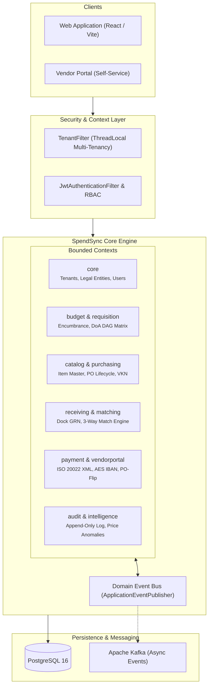
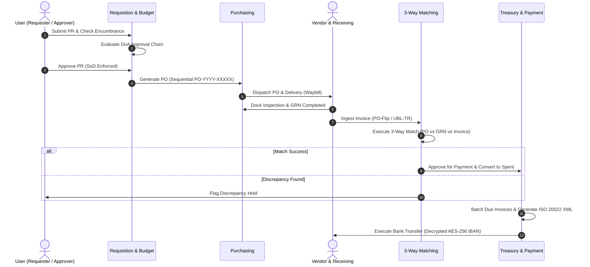

# SpendSync — Enterprise Procure-to-Pay (P2P) Engine

[](https://openjdk.org/projects/jdk/21/)
[](https://spring.io/projects/spring-boot)
[](https://react.dev/)
[](https://www.typescriptlang.org/)
[](https://www.postgresql.org/)
[](https://kafka.apache.org/)
[](LICENSE)

SpendSync is a full-stack **Procure-to-Pay (P2P)** enterprise engine designed as a **Modular Monolith** with **Domain-Driven Design (DDD)** and **Event-Driven Architecture (EDA)**. It manages the complete procurement lifecycle: budget encumbrance, dynamic approval workflows (DAG), purchase orders, dock receiving, touchless 3-way invoice matching, treasury payment runs, and vendor self-service e-invoicing.

---

<details open>
<summary><h3>🏛️ System Architecture & High-Level Design (HLD)</h3></summary>

The application is structured into **11 decoupled bounded contexts** within a Spring Boot modular monolith, communicating through in-memory Spring Domain Events and an event streaming bus.



</details>

---

<details>
<summary><h3>🔄 End-to-End P2P Execution Pipeline</h3></summary>



</details>

---

<details>
<summary><h3>🛠️ Tech Stack & Architecture Matrix</h3></summary>

| Layer | Technologies |
| :--- | :--- |
| **Backend Framework** | Java 21 (LTS), Spring Boot 3.3.0, Spring Data JPA, Spring Security |
| **Persistence & Messaging** | PostgreSQL 16, Hibernate 6, HikariCP, Apache Kafka 3.7 (KRaft) |
| **Security & Crypto** | JJWT (HMAC-SHA512), AES-256-GCM, BCrypt |
| **API & Documentation** | SpringDoc OpenAPI 2.5, Swagger UI, Bean Validation |
| **Frontend Framework** | React 18.3, TypeScript 5.5, Vite 5.4 |
| **State & Styling** | TanStack React Query v5, Zustand, TailwindCSS, Lucide Icons, Axios |
| **Infrastructure** | Docker, Docker Compose |

</details>

---

<details>
<summary><h3>🚀 Quickstart & Local Setup</h3></summary>

#### Prerequisites
- Java 21+
- Node.js 18+
- Docker & Docker Compose

#### 1. Start Infrastructure (PostgreSQL & Kafka)
```bash
docker compose -f docker/docker-compose.yml up -d
```

#### 2. Launch Backend
```bash
cd backend
mvn clean spring-boot:run
```
- API Server: `http://localhost:8080`
- Swagger UI Documentation: `http://localhost:8080/swagger-ui.html`

#### 3. Launch Frontend
```bash
cd frontend
npm install
npm run dev
```
- Web Application: `http://localhost:5173`

</details>

---

## 📄 License

This project is licensed under the [MIT License](LICENSE).
