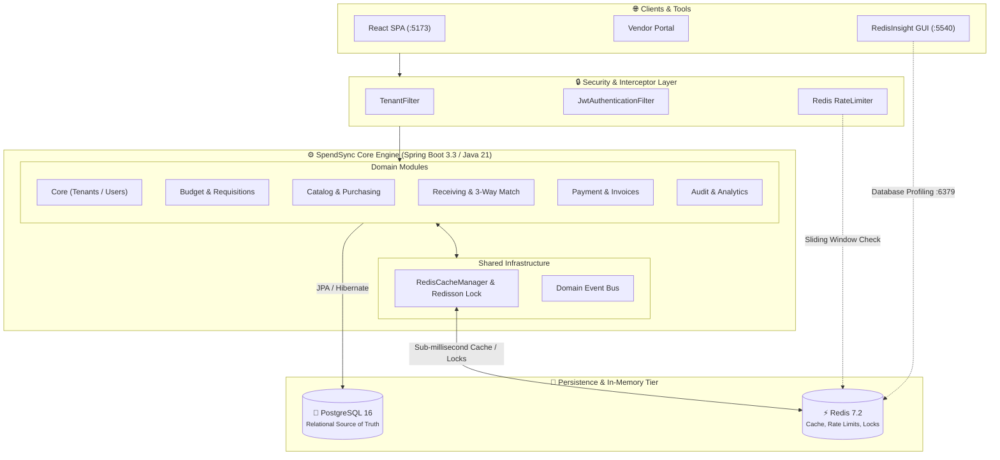
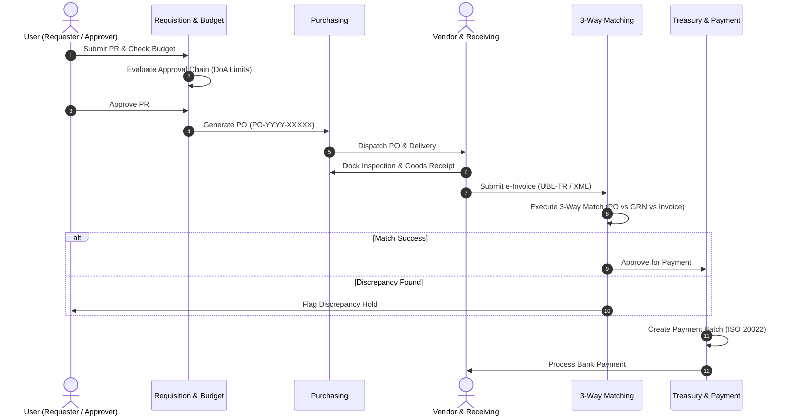

# SpendSync — Procurement & Spend Management System

[](https://openjdk.org/projects/jdk/21/)
[](https://spring.io/projects/spring-boot)
[](https://redis.io/)
[](https://react.dev/)
[](https://www.typescriptlang.org/)
[](https://www.postgresql.org/)
[](https://www.docker.com/)
[](LICENSE)

SpendSync is an enterprise procurement and spend management platform built with Spring Boot, Java 21, Redis, and React. It covers standard purchasing workflows: purchase requisitions, approval chains, purchase orders, goods receiving, 3-way invoice matching, payment batches, and a self-service vendor portal.

---

<details open>
<summary><h3>🏛️ System Architecture</h3></summary>

The application is structured as a hardened Modular Monolith. It integrates **PostgreSQL 16** as the persistent relational source of truth and **Redis 7.2** for high-throughput L2 multi-TTL caching, distributed rate limiting, and concurrency control.



</details>

---

<details>
<summary><h3>🔄 Purchasing Lifecycle Pipeline</h3></summary>



</details>

---

<details>
<summary><h3>🛠️ Tech Stack</h3></summary>

| Layer | Technologies |
| :--- | :--- |
| **Backend Framework** | Java 21, Spring Boot 3.3.0, Spring Data JPA, Spring Security, Spring AOP |
| **In-Memory & Caching** | Redis 7.2, Redisson 3.31.0, Spring Data Redis, Jackson2 JSON Serializer |
| **Persistence** | PostgreSQL 16, Hibernate 6, HikariCP |
| **Security & Rate Limiting** | JWT (JJWT), BCrypt, RBAC, Redis ZSet Sliding Window Rate Limiting |
| **Events** | Spring Domain Events (`ApplicationEventPublisher`) |
| **API & Documentation** | SpringDoc OpenAPI 2.5, Swagger UI, Bean Validation |
| **Frontend Framework** | React 18.3, TypeScript 5.5, Vite 5.4 |
| **State & Styling** | TanStack React Query v5, Zustand, TailwindCSS, Lucide Icons, Axios |
| **Infrastructure & Tools** | Docker (Multi-stage Layered JAR), Docker Compose, RedisInsight |

</details>

---

<details>
<summary><h3>🚀 Quickstart & Local Setup</h3></summary>

#### Prerequisites
- Java 21+
- Node.js 18+
- Docker & Docker Compose

#### 1. Start Infrastructure (PostgreSQL 16, Redis 7.2 & RedisInsight)
```bash
docker compose -f docker/docker-compose.yml up -d
```
- PostgreSQL: `localhost:5432`
- Redis: `localhost:6379`
- RedisInsight Web GUI: `http://localhost:5540`

#### 2. Launch Backend
```bash
cd backend
mvn clean spring-boot:run
```
- API Server: `http://localhost:8080`
- Swagger UI Documentation: `http://localhost:8080/swagger-ui.html`
- Health Probes: `http://localhost:8080/actuator/health`

#### 3. Launch Frontend
```bash
cd frontend
npm install
npm run dev
```
- Web Application: `http://localhost:5173`

</details>

---

## 📄 License

This project is licensed under the [MIT License](LICENSE).
