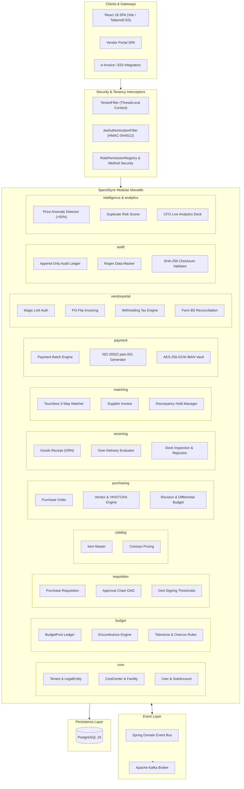
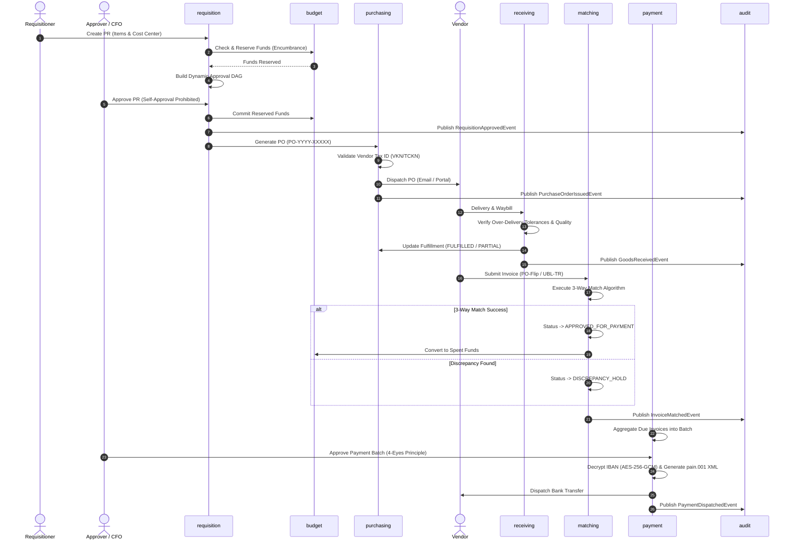

# SpendSync — Enterprise Procure-to-Pay (P2P) Engine

[](https://openjdk.org/projects/jdk/21/)
[](https://spring.io/projects/spring-boot)
[](https://react.dev/)
[](https://www.typescriptlang.org/)
[](https://www.postgresql.org/)
[](https://kafka.apache.org/)
[](LICENSE)

SpendSync is a full-stack **Procure-to-Pay (P2P)** enterprise engine designed as a **Modular Monolith** with **Domain-Driven Design (DDD)** and **Event-Driven Architecture (EDA)**. It manages the complete procurement lifecycle: budget encumbrance, dynamic approval workflows (DAG), purchase orders, dock receiving, touchless 3-way invoice matching, treasury payment runs, and vendor self-service e-invoicing.

---

## 🏛️ High-Level System Architecture (HLD)

The application is structured into **11 decoupled bounded contexts** within a single deployable artifact. Modules communicate across domain boundaries primarily via asynchronous domain events (`ApplicationEventPublisher` / Apache Kafka).



---

## 🔄 End-to-End P2P Execution Pipeline



---

## ⚙️ Core Technical Mechanics

### 1. Multi-Tenancy & Data Isolation
- **ThreadLocal Storage:** `TenantContext` holds current tenant ID per request.
- **HTTP Header Interception:** `TenantFilter` parses `X-Tenant-ID` with strict UUID validation and guaranteed `finally` cleanup.
- **Query Scoping:** Spring Data JPA repositories scope entities by `tenant_id`.

### 2. Encumbrance Accounting & Bütçe Havuzları
- **Fund Lifecycle:** `Allocated` $\rightarrow$ `Reserved` (on PR creation) $\rightarrow$ `Committed` (on PO issuance) $\rightarrow$ `Spent` (on invoice match).
- **Enforcement Modes:** `HARD_STOP` (strict ceiling), `TOLERANCE` (percentage-based dynamic ceiling), `SOFT_ALERT`.
- **Deadlock-Free Transfers:** Inter-pool balance adjustments acquire locks deterministically ordered by `costCenterId`.

### 3. Dynamic Approval Matrix (DAG) & Delegation of Authority (DoA)
- **Hierarchy-Aware Evaluation:** Evaluates cost center signing limits (e.g., Staff = 0, Lead = 50k, Director = 75k, CFO = Unlimited).
- **Segregation of Duties (SoD):** Enforces 4-eyes principle; prevents creator from approving their own PR or Payment Batch (`SOD_VIOLATION_SELF_APPROVAL`).

### 4. Touchless 3-Way Matching Engine
- **Evaluation Vector:** Compares **Purchase Order Line Items**, **Goods Receipt Accepted Quantities**, and **Supplier Invoice Lines**.
- **Tolerance Enforcement:** Configurable unit price (+-2%) and quantity discrepancy thresholds.
- **Automated Routing:** Matches without discrepancies transition directly to `APPROVED_FOR_PAYMENT`; exceptions trigger `DISCREPANCY_HOLD`.

### 5. Cryptography & Statutory Integrations
- **IBAN Encryption:** Vendor bank account IBANs are encrypted at rest using `AES-256-GCM` with random 12-byte IVs.
- **Tax Number Verification:** Algorithms validate 10-digit VKN (modulo-9/powers-of-2) and 11-digit TCKN check digits.
- **Withholding Tax (KDV Tevkifatı):** Computes statutory VAT deductions for standard GİB codes (`601`, `608`, `627`, `610`).
- **ISO 20022 Generation:** Produces `pain.001.001.03` Customer Credit Transfer Initiation XML messages.
- **Digital Reconciliation Seals:** Computes SHA-256 digital signatures for Form BS monthly reconciliation batches.

### 6. Append-Only Audit Trail
- **Immutability:** `AuditLog` entity has no update or delete operations (append-only ledger).
- **Isolation:** Saved via `@Transactional(propagation = Propagation.REQUIRES_NEW)` to persist logs even if parent transaction aborts.
- **Sensitive Data Masking:** Regex filters mask credentials (`"password": "********"`, `"token": "********"`).
- **Tamper-Evidence:** Each log entry stores a SHA-256 hash computed over `tenant:correlationId:action:entityType:entityId:amount:createdAt:actorId`.

---

## 🛠️ Tech Stack

| Layer | Technologies |
| :--- | :--- |
| **Backend Framework** | Java 21 (LTS), Spring Boot 3.3.0, Spring Data JPA, Spring Security |
| **Persistence & Messaging** | PostgreSQL 16, Hibernate 6, HikariCP, Apache Kafka 3.7 (KRaft) |
| **Security & Crypto** | JJWT (HMAC-SHA512), AES-256-GCM, BCrypt |
| **API & Documentation** | SpringDoc OpenAPI 2.5, Swagger UI, Bean Validation |
| **Frontend Framework** | React 18.3, TypeScript 5.5, Vite 5.4 |
| **State & Styling** | TanStack React Query v5, Zustand, TailwindCSS, Lucide Icons, Axios |
| **Infrastructure** | Docker, Docker Compose |

---

## 🚀 Quickstart

### Prerequisites
- Java 21+
- Node.js 18+
- Docker & Docker Compose

### 1. Start Infrastructure (PostgreSQL & Kafka)
```bash
docker compose -f docker/docker-compose.yml up -d
```

### 2. Launch Backend
```bash
cd backend
mvn clean spring-boot:run
```
- API Server: `http://localhost:8080`
- Swagger UI Documentation: `http://localhost:8080/swagger-ui.html`

### 3. Launch Frontend
```bash
cd frontend
npm install
npm run dev
```
- Web Application: `http://localhost:5173`

---

## 📄 License

This project is licensed under the [MIT License](LICENSE).

