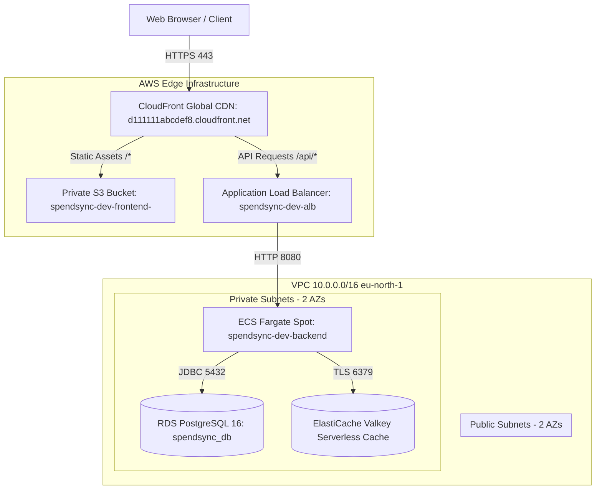
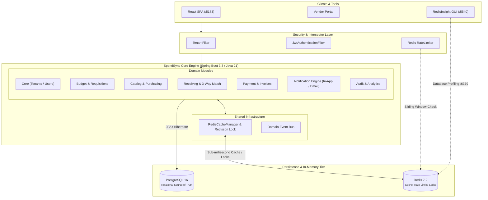
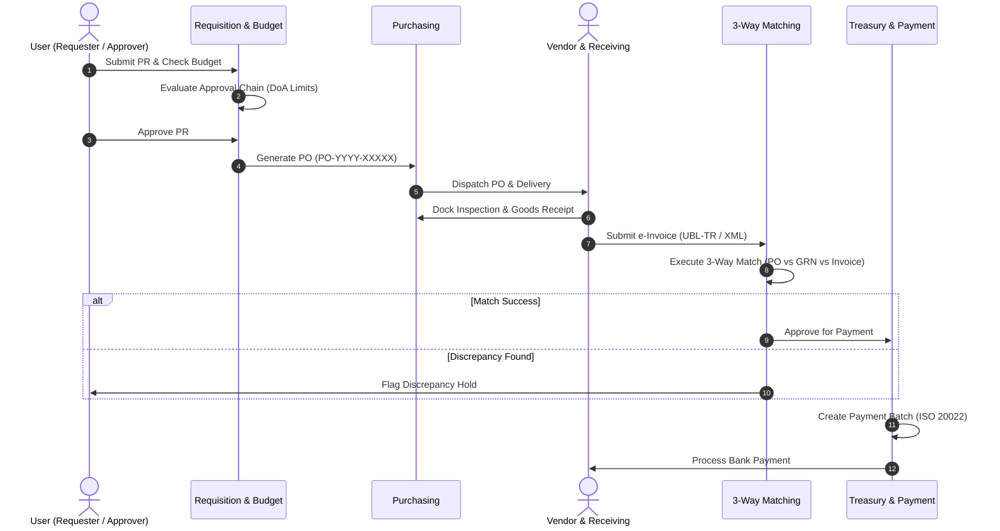

# SpendSync — Procurement & Spend Management System

[](https://openjdk.org/projects/jdk/21/)
[](https://spring.io/projects/spring-boot)
[](https://aws.amazon.com/)
[](https://www.terraform.io/)
[](https://github.com/features/actions)
[](https://www.postgresql.org/)
[](https://redis.io/)
[](https://react.dev/)
[](https://www.typescriptlang.org/)
[](https://www.docker.com/)
[](LICENSE)

SpendSync is a procurement and spend management platform built with Spring Boot 3.3, Java 21, Redis 7.2, and React 18. It automates purchasing workflows including purchase requisitions, approval chains, purchase orders, goods receipts, three-way invoice matching, payment batches, and a self-service vendor portal.

---

## Technical Documentation and Operational Guides

Comprehensive technical specifications, operational procedures, and architectural decisions are documented within the `docs/` directory:

- **[System and Cloud Architecture](docs/ARCHITECTURE.md):** Complete specification covering domain modules, multi-stage containerization, AWS ECR lifecycle policies, Terraform infrastructure modules (VPC, Security Groups, RDS PostgreSQL 16, ElastiCache Serverless Valkey, ALB, ECS Fargate Spot), CloudFront Origin Access Control, and CI/CD pipelines.
- **[Incident Post-Mortems and Troubleshooting](docs/POST_MORTEMS.md):** Detailed technical analysis of 11 production incidents, detailing symptoms, root causes, corrective actions, and preventative controls.
- **[Operations Runbook](docs/RUNBOOK.md):** Standard operating procedures for service deployment, automated smoke tests, manual health checks, ECS task rollback, CloudFront cache invalidation, and CloudWatch log inspection.
- **Architecture Decision Records (ADRs):**
  - [ADR 001: Selection of AWS ECS Fargate Over AWS EKS](docs/adr/001-ecs-over-eks.md)
  - [ADR 002: CloudFront Unified Origin and Reverse Proxy for API Routing](docs/adr/002-cloudfront-reverse-proxy.md)

---

## Live Demonstration and Deployment Status

- **Web Application:** `https://d111111abcdef8.cloudfront.net` *(Amazon CloudFront & S3 Private Origin)*
- **API Ingress:** `https://d111111abcdef8.cloudfront.net/api/v1/`
- **Operational Availability:** To optimize cloud operational expenditures and eliminate idle runtime costs, compute resources (AWS ECS Fargate Spot) and managed data stores are provisioned on demand via automated CI/CD workflows. The complete environment can be spun up on request through GitHub Actions.
- **Demonstration Credentials:**
  - Email: `cfo@spendsync.com`
  - Password: `Password123!`

---

<details open>
<summary><h3>Cloud Infrastructure Topology</h3></summary>

The platform is provisioned via Infrastructure as Code (Terraform `>= 1.11.0`) on AWS (`eu-north-1`):


```mermaid
flowchart TD
    Client[Web Browser / Client] -->|HTTPS 443| CloudFront[CloudFront Global CDN: d111111abcdef8.cloudfront.net]

    subgraph AWS_Edge [AWS Edge Infrastructure]
        CloudFront -->|Static Assets /*| S3[Private S3 Bucket: spendsync-dev-frontend-<AWS_ACCOUNT_ID>]
        CloudFront -->|API Requests /api/*| ALB[Application Load Balancer: spendsync-dev-alb]
    end

    subgraph AWS_VPC [VPC 10.0.0.0/16 eu-north-1]
        subgraph Public_Subnets [Public Subnets - 2 AZs]
            ALB
        end

        subgraph Private_Subnets [Private Subnets - 2 AZs]
            ECS[ECS Fargate Spot: spendsync-dev-backend]
            RDS[(RDS PostgreSQL 16: spendsync_db)]
            Valkey[(ElastiCache Valkey Serverless Cache)]
        end
    end

    ALB -->|HTTP 8080| ECS
    ECS -->|JDBC 5432| RDS
    ECS -->|TLS 6379| Valkey
```

- **Edge & Static Delivery:** Static assets reside in a private S3 bucket accessed via CloudFront Origin Access Control (SigV4). All `/api/*` traffic routes directly to the Application Load Balancer over HTTPS, eliminating CORS preflight overhead and browser mixed content restrictions.
- **Container Compute:** The Spring Boot backend runs in Amazon ECS Fargate Spot tasks behind an Application Load Balancer with multi-AZ private subnet routing to Amazon RDS PostgreSQL 16 (Graviton gp3) and Amazon ElastiCache Serverless Valkey (Redis 7.2 compatible with in-transit TLS).
- **Gated CI/CD:** GitHub Actions workflows enforce Gitleaks secret scanning, Flyway migration linting, JaCoCo coverage thresholds, and manual or semantic tag-triggered zero-downtime deployments with post-deploy smoke tests.

</details>

---

<details open>
<summary><h3>System Architecture</h3></summary>

The application is structured as a Modular Monolith. It integrates **PostgreSQL 16** as the persistent relational source of truth and **Redis 7.2** for high-throughput L2 multi-TTL caching, distributed rate limiting, and concurrency control.


```mermaid
graph TB
    subgraph Clients["Clients & Tools"]
        SPA["React SPA (:5173)"]
        VP["Vendor Portal"]
        INSIGHT["RedisInsight GUI (:5540)"]
    end

    subgraph Security["Security & Interceptor Layer"]
        TF["TenantFilter"]
        AUTH["JwtAuthenticationFilter"]
        RATE["Redis RateLimiter"]
    end

    subgraph Monolith["SpendSync Core Engine (Spring Boot 3.3 / Java 21)"]
        subgraph DomainModules["Domain Modules"]
            direction TB
            M_CORE["Core (Tenants / Users)"]
            M_BGT["Budget & Requisitions"]
            M_CAT["Catalog & Purchasing"]
            M_RCV["Receiving & 3-Way Match"]
            M_PAY["Payment & Invoices"]
            M_NTF["Notification Engine (In-App / Email)"]
            M_GOV["Audit & Analytics"]
        end

        subgraph Infra["Shared Infrastructure"]
            CACHE_MGR["RedisCacheManager & Redisson Lock"]
            EVENT_BUS["Domain Event Bus"]
        end
    end

    subgraph Storage["Persistence & In-Memory Tier"]
        DB[("PostgreSQL 16<br/><small>Relational Source of Truth</small>")]
        REDIS[("Redis 7.2<br/><small>Cache, Rate Limits, Locks</small>")]
    end

    Clients --> Security
    Security --> DomainModules
    RATE -.->|Sliding Window Check| REDIS
    DomainModules <--> Infra
    DomainModules -->|JPA / Hibernate| DB
    CACHE_MGR <-->|Sub-millisecond Cache / Locks| REDIS
    INSIGHT -.->|Database Profiling :6379| REDIS
```

</details>

---

<details>
<summary><h3>Purchasing Lifecycle Pipeline</h3></summary>


```mermaid
sequenceDiagram
    autonumber
    actor User as User (Requester / Approver)
    participant Req as Requisition & Budget
    participant PO as Purchasing
    actor Vendor as Vendor & Receiving
    participant Match as 3-Way Matching
    participant Pay as Treasury & Payment

    User->>Req: Submit PR & Check Budget
    Req->>Req: Evaluate Approval Chain (DoA Limits)
    User->>Req: Approve PR

    Req->>PO: Generate PO (PO-YYYY-XXXXX)
    PO->>Vendor: Dispatch PO & Delivery
    Vendor->>PO: Dock Inspection & Goods Receipt
    Vendor->>Match: Submit e-Invoice (UBL-TR / XML)
    Match->>Match: Execute 3-Way Match (PO vs GRN vs Invoice)
    alt Match Success
        Match->>Pay: Approve for Payment
    else Discrepancy Found
        Match->>User: Flag Discrepancy Hold
    end

    Pay->>Pay: Create Payment Batch (ISO 20022)
    Pay->>Vendor: Process Bank Payment
```

</details>

---

<details>
<summary><h3>Tech Stack</h3></summary>

| Layer | Technologies |
| :--- | :--- |
| **Backend Framework** | Java 21, Spring Boot 3.3.0, Spring Data JPA, Spring Security, Spring AOP |
| **Notifications & Mail** | Jakarta Mail, JavaMailSender, Thymeleaf Template Engine, Spring Scheduling |
| **In-Memory & Caching** | Redis 7.2, Redisson 3.31.0, Spring Data Redis, Jackson2 JSON Serializer |
| **Persistence** | PostgreSQL 16, Hibernate 6, HikariCP, Flyway |
| **Security & Rate Limiting** | JWT (JJWT), BCrypt, RBAC, Redis ZSet Sliding Window Rate Limiting |
| **Events** | Spring Domain Events (`ApplicationEventPublisher`, `@TransactionalEventListener`) |
| **API & Documentation** | SpringDoc OpenAPI 2.5, Swagger UI, Bean Validation |
| **Frontend Framework** | React 18.3, TypeScript 5.5, Vite 5.4 |
| **State & Styling** | TanStack React Query v5, Zustand, TailwindCSS, Lucide Icons, Axios |
| **Cloud Infrastructure** | AWS ECS Fargate Spot, AWS RDS PostgreSQL 16 (Graviton gp3), ElastiCache Serverless Valkey, CloudFront, S3, ECR |
| **IaC & CI/CD Pipeline** | Terraform 1.11 (Native S3 Locking), GitHub Actions, Gitleaks, JaCoCo, Flyway |
| **Local Tools** | Docker (Multi-stage Layered JAR), Docker Compose, RedisInsight |

</details>

---

<details open>
<summary><h3>Automated Testing & Coverage Metrics</h3></summary>

The backend test suite contains **577 automated tests** executed via JUnit 5, Mockito, and Testcontainers (PostgreSQL 16 & Redis 7.2). All boilerplate artifacts (Entities, DTOs, Configurations) are excluded to reflect pure domain logic.

| Metric | Measured Value | Covered / Total Units | Scope |
| :--- | :--- | :--- | :--- |
| **Line Coverage** | **78.46%** | 3,967 / 5,056 Lines | Pure business, service, and security logic |
| **Branch Coverage** | **54.08%** | 954 / 1,764 Branches | Domain invariants & boundary matrix |
| **Instruction Coverage** | **72.31%** | 18,150 / 25,101 Instructions | JVM bytecode execution coverage |
| **Test Suite Status** | **100% Passing** | 577 Tests (0 Failures, 0 Skipped) | Executed in ~48s |

#### Container Integration Test Suite (`com.enterprise.spendsync.testcontainers`)

Container integration tests execute against dedicated PostgreSQL 16 and Redis 7.2 instances to validate behavior requiring real database locking and in-memory data structures:

1. **Sliding Window Rate Limiting (`RateLimitContainerTest`):**
   - Evaluates Redis `ZSET` time-window eviction (`ZREMRANGEBYSCORE`, `ZCARD`, `ZADD`).
   - Validates that requests within threshold succeed (`HTTP 200 OK`) and excess requests are intercepted (`HTTP 429 Too Many Requests`) with correct `Retry-After` and `X-RateLimit-*` headers.

2. **Pessimistic Locking & Concurrency Control (`BudgetConcurrencyContainerTest`):**
   - Simulates 10 concurrent threads attempting simultaneous budget reservations against a fixed allocation pool.
   - Validates PostgreSQL row-level `@Lock(LockModeType.PESSIMISTIC_WRITE)` (`SELECT ... FOR UPDATE`), confirming that exactly 5 requests succeed, 5 are rejected due to insufficient funds, and the remaining pool balance equals 0.00 with zero double-spending.

3. **Multi-TTL L2 Caching (`CatalogCacheContainerTest`):**
   - Validates Spring Cache interception, writing domain entities to Redis with configured TTLs (e.g., 6 hours for catalog data, 12 hours for tenant configuration).
   - Confirms polymorphic JSON serialization via `GenericJackson2JsonRedisSerializer` and sub-millisecond cache hit retrieval.

</details>

---

<details>
<summary><h3>Quickstart & Local Setup</h3></summary>

#### Prerequisites
- Java 21+
- Node.js 18+
- Docker & Docker Compose

#### 1. Start Infrastructure (PostgreSQL 16, Redis 7.2 & RedisInsight)
```bash
docker compose -f docker/docker-compose.yml up -d
```
- PostgreSQL: `localhost:5432`
- Redis: `localhost:6379`
- RedisInsight Web GUI: `http://localhost:5540`

#### 2. Launch Backend
```bash
cd backend
mvn clean spring-boot:run
```
- API Server: `http://localhost:8080`
- Swagger UI Documentation: `http://localhost:8080/swagger-ui.html`
- Health Probes: `http://localhost:8080/actuator/health`

#### 3. Run Backend Test Suite & Coverage Report
```bash
cd backend
mvn clean test
```
- JaCoCo HTML Report: `backend/target/site/jacoco/index.html`

#### 4. Launch Frontend
```bash
cd frontend
npm install
npm run dev
```
- Web Application: `http://localhost:5173`

</details>

---

## License

This project is licensed under the [MIT License](LICENSE).
