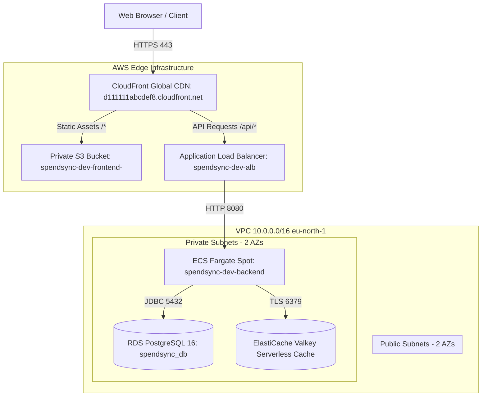

# SpendSync System Architecture Documentation

This document describes the end-to-end architecture of the SpendSync platform, covering application topology, containerization, cloud infrastructure, networking, continuous delivery, and operational controls.

---

## 1. System Overview

SpendSync is a procurement and spend management platform architected as a modular monolith. It unifies purchase requisitions, approval hierarchies, purchase order generation, goods receipt processing, three-way matching, and supplier interaction within a cohesive codebase.

### 1.1. High-Level Component Topology



---

## 2. Application Architecture

The core application is implemented in Java 21 using Spring Boot 3.3. It operates as a modular monolith where domain boundaries are enforced via package visibility and interface contracts rather than network calls.

### 2.1. Domain Modules
- **Core (`com.enterprise.spendsync.core`):** Identity management, multi-tenant isolation, role-based access control (RBAC), and user onboarding.
- **Budget (`com.enterprise.spendsync.budget`):** Fiscal year budget pools, commitments, allocation tracking, and transaction history.
- **Requisition (`com.enterprise.spendsync.requisition`):** Purchase requests, line items, and approval workflows.
- **Purchasing (`com.enterprise.spendsync.purchasing`):** Purchase order lifecycle, supplier catalogs, and contract status.
- **Receiving (`com.enterprise.spendsync.receiving`):** Goods receipts, warehouse delivery verification, and inspection records.
- **Invoice & Matching (`com.enterprise.spendsync.invoice`):** Supplier invoices, three-way matching rules, variance tolerance checks, and payment release batches.

### 2.2. Frontend Application
The user interface is a single-page application (SPA) built with React 18, Vite 5, TypeScript, TailwindCSS, and TanStack React Query. It is bundled into static assets and distributed via Amazon CloudFront.

---

## 3. Containerization Architecture

### 3.1. Backend Container (`backend/Dockerfile`)
The backend container uses a multi-stage Dockerfile based on Ubuntu-derived Eclipse Temurin distributions:

1. **Build Stage (`eclipse-temurin:21-jdk-jammy`):**
   - Maven dependencies are cached independently of application source code to minimize rebuild durations.
   - Compiles and packages an executable fat-JAR via `mvn clean package -DskipTests`.
2. **Runtime Stage (`eclipse-temurin:21-jre-jammy`):**
   - Employs a stripped JRE distribution, yielding an image footprint of approximately 210 MB.
   - Creates an unprivileged system user (`spendsync:spendsync`, UID 10001) to prevent root execution.
   - Enforces JVM memory constraints aligned with AWS Fargate container limits:
     ```bash
     JAVA_OPTS="-XX:+UseG1GC \
                -XX:MaxRAMPercentage=75.0 \
                -XX:InitialRAMPercentage=50.0 \
                -XX:+ExitOnOutOfMemoryError \
                -Djava.security.egd=file:/dev/./urandom"
     ```
   - Supports graceful termination: captures `SIGTERM` signals and allows up to 20 seconds for in-flight HTTP requests to conclude (`server.shutdown=graceful`).

---

## 4. Container Registry (Amazon ECR)

Container images are stored in a private Amazon Elastic Container Registry (ECR) repository:

- **Repository URI:** `<AWS_ACCOUNT_ID>.dkr.ecr.eu-north-1.amazonaws.com/spendsync-backend`
- **Tag Immutability:** Enabled (`image_tag_mutability = "IMMUTABLE"`). Tags cannot be overwritten once pushed. Every deployment generates a distinct tag matching the Git commit SHA (`sha-<commit>`).
- **Vulnerability Scanning:** Enabled (`scan_on_push = true`). Automated Common Vulnerabilities and Exposures (CVE) scanning executes upon image ingestion.
- **Lifecycle Management:** Retains the 10 most recent tagged releases. Untagged intermediate build layers are automatically purged after 7 days.

---

## 5. Cloud Infrastructure (Terraform)

All AWS infrastructure is declared using Terraform (`>= 1.11.0`) organized into reusable modules (`infra/modules/`) and environment orchestrations (`infra/envs/`).

### 5.1. Bootstrap Layer (`infra/bootstrap/`)
Manages prerequisite resources required by Terraform and continuous integration:
- **Remote State Bucket:** `spendsync-tf-state-<AWS_ACCOUNT_ID>-<REGION>` configured with AES256 server-side encryption, versioning, and public access blocks.
- **Native State Locking:** Utilizes S3 lockfiles (`use_lockfile = true`) introduced in Terraform 1.11, removing the requirement for a dedicated DynamoDB table.
- **Deployment Service User:** IAM user `spendsync-github-deployer` configured with least-privilege policies restricted to ECR, ECS, S3, and CloudFront operations.
- **Parameter Store Seeding:** Secure parameter values (`/spendsync/dev/jwt-secret`, `/spendsync/dev/database-password`, `/spendsync/dev/origin-verify-token`) stored as `SecureString` types.

### 5.2. Networking Layer (`infra/modules/vpc/`)
- **VPC CIDR:** `10.0.0.0/16` located in `eu-north-1` (Stockholm).
- **Subnet Layout:**
  - Public Subnets: `10.0.1.0/24` (AZ-a) and `10.0.2.0/24` (AZ-b) hosting the Application Load Balancer.
  - Private Subnets: `10.0.10.0/24` (AZ-a) and `10.0.11.0/24` (AZ-b) hosting ECS container instances, RDS PostgreSQL, and ElastiCache Valkey.
- **Internet Gateway:** Provides external routing for public subnets.
- **NAT Gateways:** Omitted to reduce baseline operational costs; ECS tasks operate with public IP assignment in public routing tables or access external dependencies via public subnets.

### 5.3. Security Groups (`infra/modules/security_groups/`)
Enforces multi-tier network isolation through chained security group rules:
- **ALB Security Group:** Ingress allowed on ports 80 and 443 from `0.0.0.0/0`.
- **ECS Security Group:** Ingress allowed on port 8080 restricted exclusively to the ALB Security Group ID.
- **RDS Security Group:** Ingress allowed on port 5432 restricted exclusively to the ECS Security Group ID.
- **Valkey Security Group:** Ingress allowed on port 6379 restricted exclusively to the ECS Security Group ID.

Direct public ingress to database and cache layers is structurally prohibited.

### 5.4. Database and Cache Layer
- **Amazon RDS PostgreSQL 16:**
  - Instance Class: `db.t4g.micro` (AWS Graviton2 64-bit ARM architecture).
  - Storage: 20 GB General Purpose SSD (gp3).
  - Credentials: Master password managed and rotated via AWS Secrets Manager.
  - Backup: Automated daily snapshots retained for 7 days.
- **Amazon ElastiCache Serverless Valkey:**
  - Redis 7.2 compatibility layer running on open-source Valkey.
  - Serverless architecture dynamically allocating memory between 0 GB and 1 GB based on active demand.
  - In-transit TLS encryption enforced on port 6379.

### 5.5. Compute and Load Balancing
- **Application Load Balancer (ALB):**
  - Name: `spendsync-dev-alb`
  - Targets: ECS Fargate instances registered on port 8080.
  - Health Probe: Evaluates `GET /actuator/health` at 30-second intervals (healthy threshold: 2 consecutive successes).
- **Amazon ECS Fargate:**
  - Cluster: `spendsync-dev-cluster`
  - Capacity Provider: Fargate Spot (delivering approximately 70% cost reduction over standard on-demand pricing).
  - Resource Allocation: 0.5 vCPU (512 CPU units) and 1024 MB RAM per task.
  - Logging: AWS CloudWatch Logs group `/ecs/spendsync-dev-backend` retaining logs for 30 days.

### 5.6. Static Frontend and Content Delivery Network
- **Amazon S3:** Private bucket `spendsync-dev-frontend-<AWS_ACCOUNT_ID>` storing compiled static distribution bundles (`dist/`). Public access is blocked.
- **Amazon CloudFront Distribution (`d111111abcdef8.cloudfront.net`):**
  - **Origin Access Control (OAC):** Secures S3 bucket access using AWS Signature Version 4 (SigV4). S3 bucket policy grants `s3:GetObject` solely to the CloudFront distribution ARN.
  - **Single Page Application Routing:** Custom error responses rewrite HTTP 403 and HTTP 404 responses from S3 to `/index.html` with HTTP 200 OK.
  - **Unified API Routing:** Routes matching `/api/*` pass directly to the Application Load Balancer over HTTP. Both frontend assets and backend APIs share the same HTTPS origin, eliminating cross-origin preflight requests (CORS) and browser mixed content restrictions.

---

## 6. Continuous Integration and Continuous Delivery (CI/CD)

Automated workflows are implemented in `.github/workflows/` and execute on a dedicated Linux self-hosted runner.

| Workflow File | Trigger Condition | Function |
| :--- | :--- | :--- |
| `security-scan.yml` | Push & PR (all branches) | Executes Gitleaks secret detection across repository history. |
| `flyway-lint.yml` | Push & PR (`backend/**`) | Validates database migration naming, checksums, and version sequencing. |
| `test.yml` | Push & PR (`backend/**`, `frontend/**`) | Executes unit tests, integration tests via Testcontainers, and frontend checks. |
| `coverage.yml` | Push & PR (`backend/**`) | Enforces minimum 80% JaCoCo code coverage on domain business logic. |
| `infra.yml` | `workflow_dispatch` | Formats, validates, plans, and conditionally applies Terraform changes per environment. |
| `backend-deploy.yml` | `workflow_dispatch` & Tag `v*` | Builds Docker image, pushes to ECR, updates ECS service, and executes live smoke tests. |
| `frontend-deploy.yml` | `workflow_dispatch` & Tag `v*` | Builds Vite assets, synchronizes to S3, and creates global CloudFront invalidations. |

### 6.1. Deployment Gating Controls
In accordance with production reliability standards, code pushes to `main` do not trigger AWS deployment jobs automatically. Deployments require:
1. An explicit manual trigger via `workflow_dispatch` in GitHub Actions, or
2. Pushing a semantic release tag (e.g., `git push origin v1.2.0`).

### 6.2. Automated Post-Deployment Verification
Upon completing an ECS service rolling update, `backend-deploy.yml` executes automated HTTP assertions against public endpoints:
- Verifies `GET /actuator/health` returns status `UP`.
- Authenticates with test credentials (`POST /api/v1/auth/login`) and asserts token presence.
- Verifies budget summary data retrieval (`GET /api/v1/budget/summary`).
- Validates platform latency checks on `/api/v1/intelligence/pulse`.

---

## 7. Multi-Environment Architecture

The infrastructure codebase is organized to support separate environments (`dev` and `prod`) with zero resource overlap:

| Attribute | Development (`infra/envs/dev`) | Production (`infra/envs/prod`) |
| :--- | :--- | :--- |
| **VPC CIDR Block** | `10.0.0.0/16` | `10.1.0.0/16` |
| **Terraform State Key** | `envs/dev/terraform.tfstate` | `envs/prod/terraform.tfstate` |
| **Compute Launch Type** | Fargate Spot | Fargate On-Demand |
| **Deployment Strategy** | ECS Rolling Update | AWS CodeDeploy (Canary) |
| **Database Resiliency** | Single-AZ `db.t4g.micro` | Multi-AZ High Availability |
| **Frontend Storage** | `spendsync-dev-frontend-...` | `spendsync-prod-frontend-...` |

---

## 8. Security Architecture

1. **Authentication & Authorization:**
   - Stateless JWT tokens signed with HMAC-SHA512 using a 512-bit key stored in AWS SSM Parameter Store.
   - Access token lifetime: 15 minutes; Refresh token lifetime: 7 days.
   - Fine-grained role-to-permission mapping managed in `RolePermissionRegistry`.
2. **Network Perimeter:**
   - Database and cache instances possess zero public IP addresses and reside strictly within private subnets.
   - CloudFront terminates external TLS 1.3 connections; direct HTTP requests to the ALB are filtered by Origin Access headers.
3. **Continuous Secret Auditing:**
   - Gitleaks scans every commit and pull request to prevent accidental leakage of AWS keys, database credentials, or private certificates.
